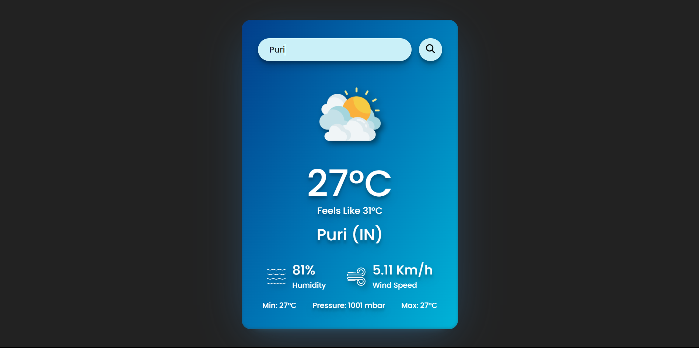

# weather-app
This is a weather application based on HTML, CSS and JavaScript
A simple web application that allows users to check the current weather conditions for a given location. It shows wind speed and humidity and other data too.

# Features
Current Weather: Get real-time weather information.
Location Search: Search for the weather in any location worldwide.
Temperature and Description: View the current temperature and weather description.

# Technologies Used
HTML, CSS, JavaScript

# Getting Started
# Prerequisites
Make sure you have a modern web browser installed. 
Installation
Clone the repository:
- bash
- Copy code
- git clone https://github.com/himanshu-g7/weather-app.git
- Open index.html in your web browser.

# Usage
- Enter the location in the search bar.
- Click the "Search" button to get the weather information.
- Screenshot
  

# Demo
A live demo is available [here.](https://hg-weather-app.netlify.app/)
